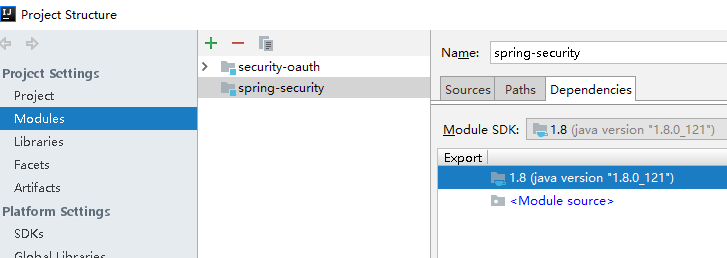
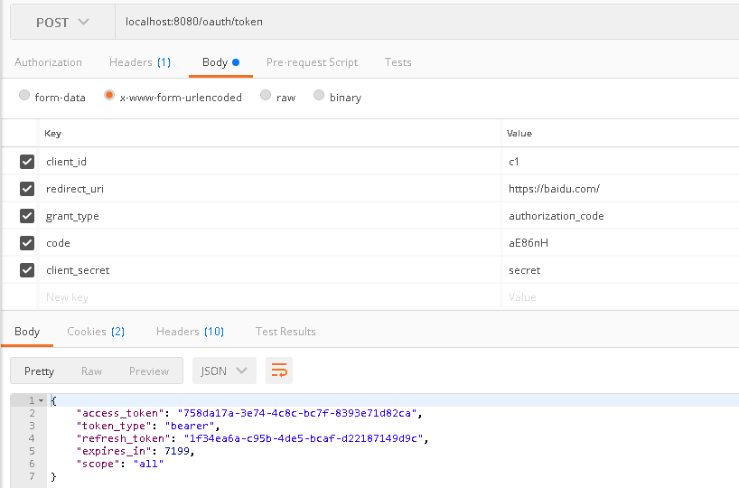
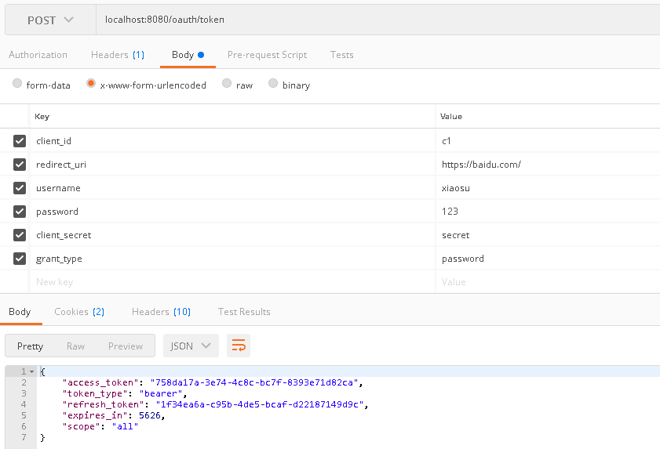
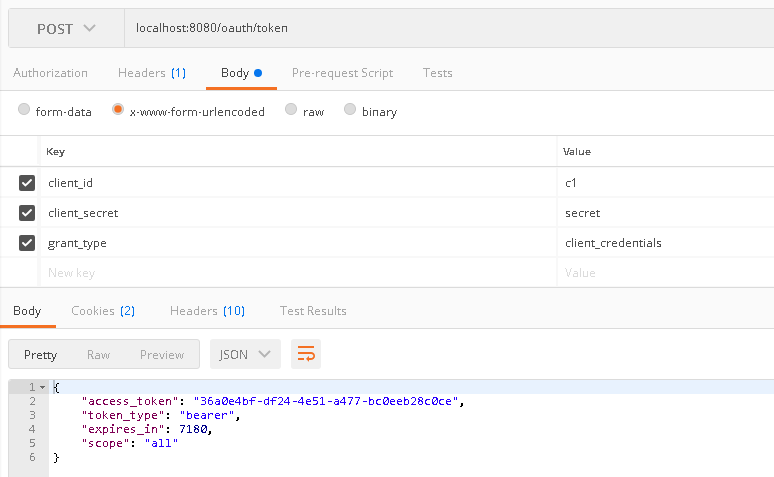

## 项目介绍
1，这个项目是看了B站，av73730658，自己借鉴写的代码 
2，当时写了很久，才写出来的，果然还是太菜了 

### 项目演示
3，当clone 代码后，需要将子项目导入到父项目的模块中，如图 
  

4，获取code的url  
http://localhost:8080/oauth/authorize?response_type=code&client_id=c1&scope=all&redirect_uri=https://baidu.com/  

5，获取令牌的url 
localhost:8080/oauth/token 

6，获取token的第二种方式，url  
http://localhost:8080/oauth/authorize?client_id=c1&response_type=token&scope=all&redirect_uri=https://baidu.com/  

7，密码模式获取令牌 ,一般用于客户端被信任的情况，因为获取令牌需要带上密码 

8，client直接获取令牌  

