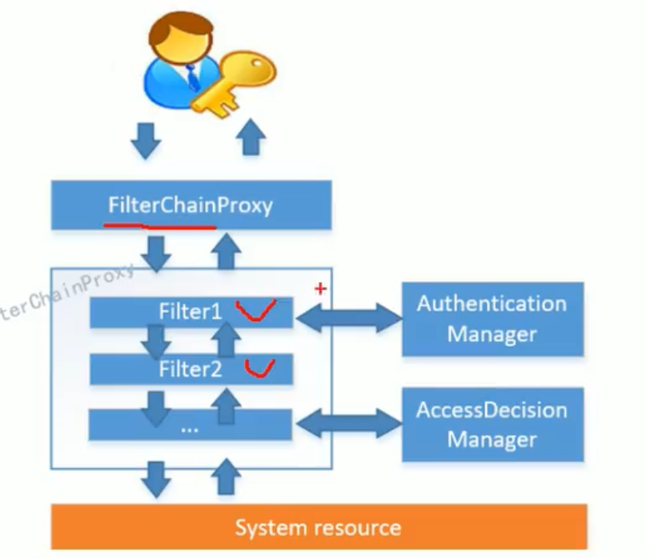
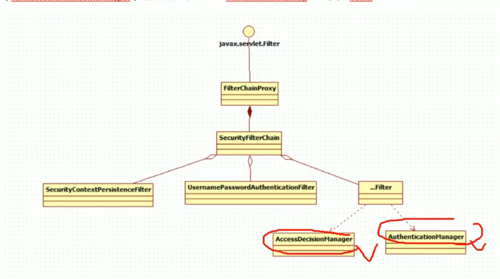
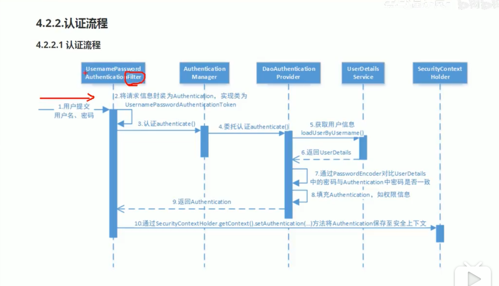
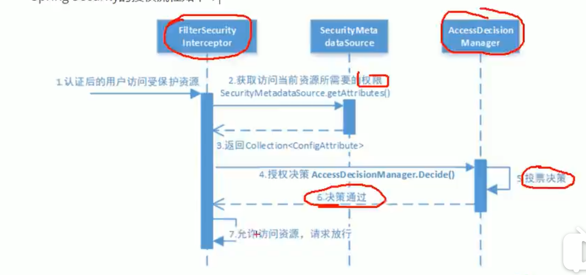
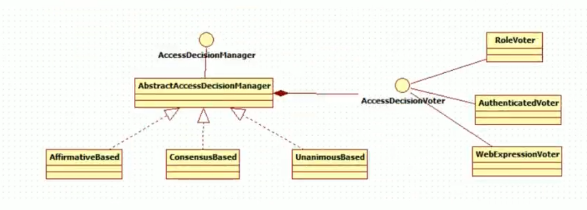
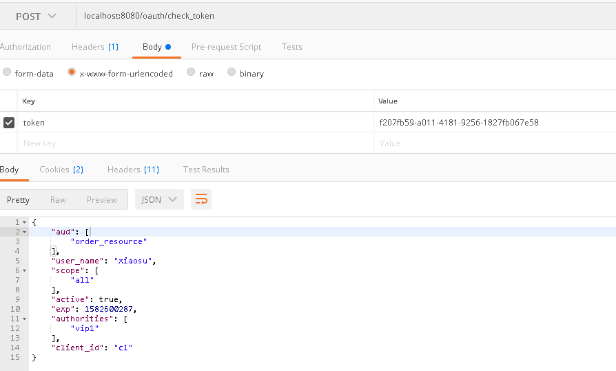
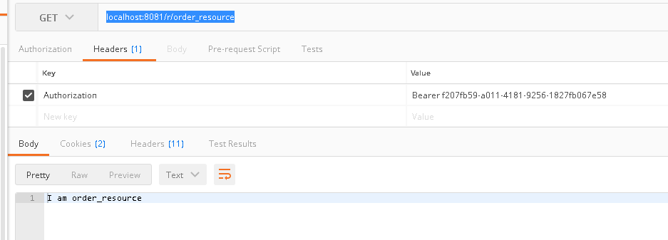
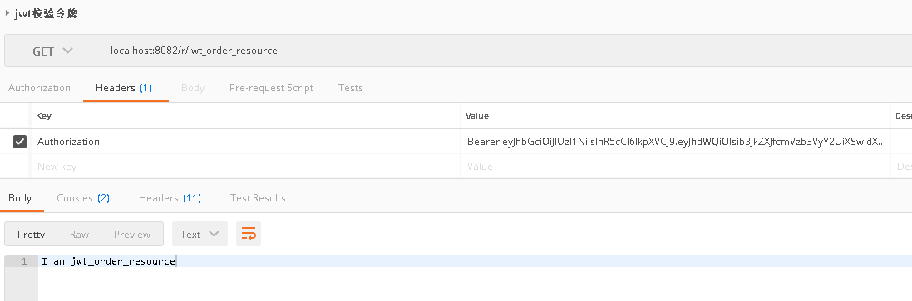

### 项目介绍
###### 1，这个项目是看了B站，av73730658，自己借鉴写的代码 
###### 2，当时写了很久，才写出来的，果然还是太菜了 

### 流程图

###### 1，security 过滤图
  

  

###### 2，认证流程图
  

###### 3，授权投票
  

###### 4，授权uml 图
  

### 项目演示
###### 3，当clone 代码后，需要将子项目导入到父项目的模块中，如图 
  

###### 4，获取code的url  
http://localhost:8080/oauth/authorize?response_type=code&client_id=c1&scope=all&redirect_uri=https://baidu.com/  

###### 5，获取令牌的url 
localhost:8080/oauth/token 

###### 6，获取token的第二种方式，url  
http://localhost:8080/oauth/authorize?client_id=c1&response_type=token&scope=all&redirect_uri=https://baidu.com/  

###### 7，密码模式获取令牌 ,一般用于客户端被信任的情况，因为获取令牌需要带上密码 

###### 8，client直接获取令牌  

###### 9，校验令牌 ，url  
localhost:8080/oauth/check_token  

###### 10，带令牌访问被保护的资源 ，url  
localhost:8081/r/order_resource  

###### 11，带jwt令牌访问资源  ，url  
localhost:8081/r/jwt_order_resource  

